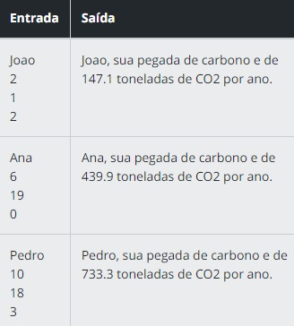
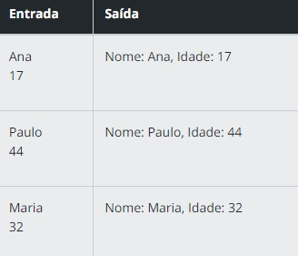
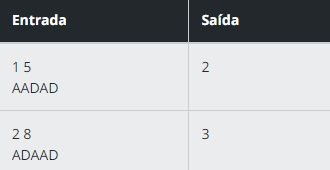
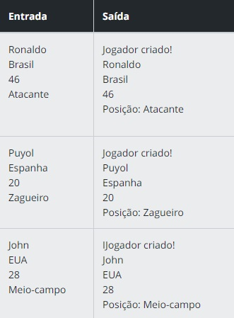
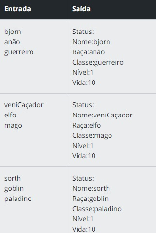
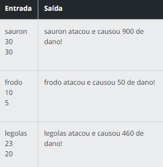

# Cshap Code Challenges

Resolução dos desafios de códigos básicos e intermediários do Programa Decola Tech 2024 da DIO em parceria com a Avanade.

## Pré-requesitos para executar os programas

> * Necessário ter o Git instalado;
> * Ter o dotnet instlado 
> * Ter uma IDE instalada de sua preferência
> * Clone o repositório;
> * Execute o programa utilizando o comando `dotnet run`


## CONVENÇÕES C# COM DESAFIOS DE CÓDIGO

> Desafios Básicos - Acesse as resoluções clicando [aqui](./DesafiosBasicos/Program.cs)


### 1. Explorando Sintaxe e Tipos de Dados

>  Registro de Usuário

#### Descrição

Neste desafio, aplicaremos conceitos essenciais de programação, seu objetivo é desenvolver uma solução simulando o registro de usuário em uma aplicação. Assegure que o código tenha uma **sintaxe** clara e organizada, com nomenclaturas significativas para **variáveis** como `email`, `nomeUsuario`, `senha` que será o local de armazenamento das informações de registro. Escolha **tipos de dados** apropriados, como o **String** para representar o `email`, `nomeUsuario` e `senha`. Certifique-se de tratar senha como strings para operações específicas.

#### Entrada

Como entrada receberemos três informações referente ao `emailCadastro`(String), `nomeUsuario`(String) e `senha`(String).

#### Saída

Construa uma mensagem de saída formatada corretamente, como nessa estrutura: ' `registroNome` + ", verifique o email: " + `registroEmail` + " para ativar."

#### Exemplos

A tabela abaixo apresenta exemplos com alguns dados de entrada e suas respectivas saídas esperadas. Certifique-se de testar seu programa com esses exemplos e com outros casos possíveis.


#### Código Base

```c#
using System;

class Program
{
    static void Main(string[] args)
    {

// TODO: Declare as variáveis para guardar as informações de nome, email e senha:


// Obtém o email e nome do usuário a partir da entrada do console
    registroEmail = Console.ReadLine();
    registroNome = Console.ReadLine();


// TODO: Imprima a mensagem formatada com o nome do usuário e o email de registro:
    Console.WriteLine( );


    }
}
```

### 2. Dominando os Operadores

> Gerenciamento de Tarefas

#### Descrição

Agora, focaremos em outro conceito fundamental de programação para desenvolver um algoritmo que possua como objetivo a simulação de um Sistema de Gerenciamento de Tarefas. Dessa forma, crie **variáveis** como, `titulo`, `descricao` e `dataVencimento` para guardar as informações das tarefas, após isso, implemente uma **estrutura condicional** '`if/else`' para verificar se a descrição da tarefa excede 50 caracteres. Caso a descrição exceda 50 carateres, trataremos essa condição exibindo uma mensagem adequada. Lembrando que as **estruturas condicionais** são fundamentais para o controle de fluxo dos programas pois realizam verificações precisas com base em condições específicas predefinidas, neste caso, é o limite de 50 caracteres.

#### Entrada

A entrada será as `Strings` com o titulo da tarefa, a descrição e a data de vencimento.

#### Saída

Será exibido a tarefa que foi adicionada com o título, descrição e data de vencimento. Mas caso a descrição tenha mais de 50 caracteres deverá ser informado: '`O Valor da descrica excede a quantidade de caracteres permitido`'.

#### Exemplos

A tabela abaixo apresenta exemplos com alguns dados de entrada e suas respectivas saídas esperadas. Certifique-se de testar seu programa com esses exemplos e com outros casos possíveis.


#### Código Base

```c#
using System;

class Program
{
    static void Main()
    {

// TODO: Crie as variáveis titulo, descricao e dataVencimento para guardar as informações das tarefas:


 // Obtém o titulo e a descricao a partir da entrada do console
    titulo = Console.ReadLine();
    descricao = Console.ReadLine();

// TODO: Crie uma estrutura condicional 'if/else' para verificar se a descrição da tarefa excede 50 caracteres.


 // Caso a descricao esteja dentro do limite é solicitado a entrada pelo console:
    dataVencimento = Console.ReadLine();


 // TODO: Imprima a descricao e a data de vencimento como nos exemplos da tabela:

        }
    }
```

### 3. Desvendando o Controle de Fluxo

> Soma de Números Pares em Intervalo

#### Descrição

Para este desafio, vamos aplicar outros conceitos fundamentais de programação, agora, criaremos um programa que calcule a soma dos números pares em um intervalo específico. Dessa forma, desenvolva uma solução clara, simples e organizada, você pode criar **variáveis** com nomes representativos, como `limiteInferior`, `limiteSuperior` e `somaPares`. Utilize uma **estrutura** de controle de fluxo, como o `for` para percorrer todos os números no intervalo definido pelos `limiteInferior e o limiteSuperior`. Dentro desse loop, crie uma **estrutura condicional** `if ` para verificar se cada número é par e se o resto da divisão por 2 é igual a zero (`i % 2 == 0`). Se a condição for verdadeira, o número é somado à variável `somaPares`.

#### Entrada

Será as informações de `limiteInferior` e `limiteSuperior`, sendo eles dois números inteiros(`int`).

#### Saída

A saída deverá informar uma String com o resultado final: $"A soma dos números pares de {`limiteInferior`} a {`limiteSuperior`} e: {`somaPares`}".

#### Exemplos

A tabela abaixo apresenta exemplos com alguns dados de entrada e suas respectivas saídas esperadas. Certifique-se de testar seu programa com esses exemplos e com outros casos possíveis.


#### Código Base

```c#
using System;

class Program
{
    static void Main()
    {
    // Solicita ao usuário os limites inferiores e superiores
    int limiteInferior = int.Parse(Console.ReadLine());
    int limiteSuperior = int.Parse(Console.ReadLine());

    // Variável para acumular a soma dos números pares
    int somaPares = 0;

    // TODO: Crie um Loop para percorrer os números no intervalo
    // Lembre-se: O limiteSuperior deve ser menor ou igual a i;
    
    // TODO: Implemente o if para verificar se o número é par:
        
    
    // TODO: Crie o acumulador para a soma dos números pares:
           
    

    // Exibe o resultado
    Console.WriteLine($"A soma dos numeros pares de {limiteInferior} a {limiteSuperior} e: {somaPares}");
    }
}
```

### 4. Utilizando Array e Listas

> Catálogo de Jogos

#### Descrição

Neste desafio, o objetivo é criar um catálogo de jogos que permita ao usuário adicionar uma quantidade específica de jogos. Inicie solicitando a quantidade desejada e, em seguida, peça o nome de cada jogo individualmente, armazenando-os em um array chamado `nomesJogos`. Utilize um loop `for` para facilitar a adição dos jogos. Após a conclusão, exiba um resumo em uma única linha, indicando a quantidade total de jogos adicionados e a lista de nomes no catálogo.

#### Entrada

O programa inicia solicitando ao usuário que insira a quantidade de jogos que deseja adicionar ao catálogo. Em seguida, para cada jogo, o usuário é solicitado a inserir o nome do jogo.

#### Saída

Ao final da adição dos jogos, o programa exibe um resumo que inclui a quantidade total de jogos adicionados e uma lista com os nomes dos jogos separados por vírgulas. Este resumo fornece uma visão geral dos jogos que foram incluídos no catálogo.

#### Exemplos

A tabela abaixo apresenta exemplos com alguns dados de entrada e suas respectivas saídas esperadas. Certifique-se de testar seu programa com esses exemplos e com outros casos possíveis.


#### Código Base

```c#
using System;

class Program
{
    static void Main()
    {
        // Pergunta ao usuário quantos jogos deseja adicionar:
        int quantidadeJogos = int.Parse(Console.ReadLine());

        // TODO: Inicializa os arrays com base na quantidade informada pelo usuário:
       

        // TODO: Crei um Loop para adicionar jogos conforme a quantidade especificada:
       

        //TODO: Chame a função AdicionarJogo para obter o nome do jogo e armazená-lo no array:
       

        // Exibe o resumo da adição de jogos
        ExibirResumoAdicaoJogos(quantidadeJogos, nomesJogos);
    }

    static void AdicionarJogo(int indice, string[] nomes)
    {
        // Entrada do nome do jogo
        nomes[indice] = Console.ReadLine();
    }

    static void ExibirResumoAdicaoJogos(int quantidadeJogos, string[] nomes)
    {
        Console.WriteLine();
    }
}
```

### 5. Manipulando Funções

> Cálculo de Pegada de Carbono

#### Descrição

Vamos desenvolver uma ferramenta para calcular a pegada de carbono de uma pessoa, dessa forma, crie **variáveis** como `nome`, `quilometrosPorDia`, `horasDeEletronicos`, `refeicoesComCarne` para armazenar as respectivas entradas do usuário. Para o cálculo da pegada, crie uma função CalcularPegadaDeCarbono que opera através da utilização de fatores de emissão específicos para cada atividade que contribui para a pegada de carbono, sendo eles:

* `quilometrosPorDia`: fator de 0.2, é a média estimada das emissões de carbono associadas a veículos motorizados ao longo de um ano.

* `horasDeEletronicos`, fator de 0.1, é a pegada de carbono relacionada ao consumo elétrico desses dispositivos.

* `refeicoesComCarne`, fator de 0.5, é utilizado para representar as emissões associadas à produção de carne.

A pegada de carbono do usuário é calculada a partir de três fatores: transporte (quilômetros diários × 365 × 0.2), eletrônicos (horas diárias × 0.1) e consumo de carne (refeições com carne por dia × 0.5). A soma desses valores fornece a pegada de carbono total, abrangendo diversas fontes de emissões.

#### Entrada

Como entrada será recebido o `nome`(string), `quilometrosPorDia`(double), `horasDeEletronicos`(int) e refeicoesComCarne(int).

#### Saída

Exiba a pegada de carbono calculada com base nas informações fornecidas pelo usuário.

#### Exemplos

A tabela abaixo apresenta exemplos com alguns dados de entrada e suas respectivas saídas esperadas. Certifique-se de testar seu programa com esses exemplos e com outros casos possíveis.



#### Código Base

```c#
using System;

class Program
{
    static void Main()
    {
        // Solicita o nome do usuário, quilômetros percorridos por dia, 
       // Horas de uso de eletrônicos por dia e o número de refeições com carne:
       string nome = Console.ReadLine();
       double quilometrosPorDia = double.Parse(Console.ReadLine());
       int horasDeEletronicos = int.Parse(Console.ReadLine());
       int refeicoesComCarne = int.Parse(Console.ReadLine());

        // Chama o método para calcular a pegada de carbono
        double pegadaDeCarbono = CalcularPegadaDeCarbono(quilometrosPorDia, horasDeEletronicos, refeicoesComCarne);
        
        // TODO: Exiba o resultado para o usuário:
        Console.WriteLine( );

        // Aguarda a entrada do usuário antes de encerrar o programa:
        Console.ReadLine();
    }

    // TODO: Crie um método/função para calcular a pegada de carbono com base nos parâmetros fornecidos:
  

}
```

## PRATICANDO ORIENTAÇÃO A OBJETOS COM DESAFIOS DE CÓDIGO EM C#

> Desafios intermediários - Acesse as resoluções clicando [aqui](./DesafiosIntermediarios/)

### 1. Primeiro Desafio com POO

> Primeiro Desafio com POO

#### Descrição

Você acabou de aprender POO e foi desafiado a criar o seu primeiro projeto. Neste código, você deve criar uma classe chamada `Pessoa` com dois atributos: `nome` e `idade`. Em seguida, deve implementar dois métodos para obter esses atributos: `getNome()` e `getIdade()`. Por fim, deve criar um objeto do tipo `Pessoa` e exibir na tela o nome e a idade usando os métodos criados.

##### Requisitos:

* Utilizar classes e métodos para implementar o programa;
* Implementar a classe Pessoa com os atributos nome e idade, e o método get para cada atributo;
* O programa deve solicitar que o usuário insira o nome e a idade da pessoa;
* O programa deve exibir o nome e a idade da pessoa inserida pelo usuário.

#### Entrada

A entrada deverá receber as informações do objeto Pessoa, conforme exemplo abaixo:

* nome (string)
* idade (int)

#### Saída

O código deverá retornar uma mensagem (string) informando o nome e idade da pessoa, de acordo com o que foi recebido como entrada. Veja como exemplo a entrada recebida abaixo:

`João`
`26`

De acordo com esses valores de entrada, a saída ficará desta maneira:

`Nome: João, Idade: 26`

#### Exemplos

A tabela abaixo apresenta exemplos com alguns dados de entrada e suas respectivas saídas esperadas. Certifique-se de testar seu programa com esses exemplos e com outros casos possíveis.



#### Código Base

```c#
using System;

class Pessoa
{
 


    public Pessoa(string n, int i)
    {
        nome = n;
        idade = i;
    }

    public string GetNome()
    {
        return nome;
    }

    public int GetIdade()
    {
        return idade;
    }
}

class Program
{
    static void Main()
    {
       

    }
}
```

### 2. Utilizando Propriedades e Métodos

> Controle de Velocidade do Robô

#### Descrição

Você foi contratado para criar um software que simule o controle de velocidade de um robô. Esse robô possui uma velocidade máxima e uma velocidade mínima. Sua tarefa é desenvolver um programa  utilizando o conceito de Orientação a Objetos para calcular a velocidade final do robô após uma sequência de comandos.Crie uma classe chamada "Robo" que possua as seguintes propriedades e métodos:

* `velocidadeAtual`: inteiro que representa a velocidade atual do robô (inicialmente 0);
* `velocidadeMaxima`: inteiro que representa a velocidade máxima do robô;
* `velocidadeMinima`: inteiro que representa a velocidade mínima do robô;
* `acelerar()`: um método que aumenta a velocidade atual em 1 unidade, desde que não ultrapasse a velocidade máxima;
* `desacelerar()`: um método que diminui a velocidade atual em 1 unidade, desde que não fique abaixo da velocidade mínima.

#### Entrada

A entrada consiste em duas linhas: A primeira linha contém dois inteiros Vmin e Vmax (1 ≤ Vmin < Vmax ≤ 100), representando a velocidade mínima e máxima do robô, respectivamente.
A segunda linha contém uma sequência de comandos (com no máximo 100 caracteres), onde: 'A' representa uma aceleração e 'D' representa uma desaceleração. Desta maneira, a entrada seria da seguinte maneira:

* `Vmin Vmax`: ambos valores int.
* `comandos`: string.

#### Saída

A saída deve apresentar apenas a velocidade final (int)  do robô, considerando as regras descritas nos métodos de acelerar e desacelerar.

#### Exemplos

A tabela abaixo apresenta exemplos com alguns dados de entrada e suas respectivas saídas esperadas. Certifique-se de testar seu programa com esses exemplos e com outros casos possíveis.



#### Código Base

```c#
using System;

class Robo
{
    public int VelocidadeAtual { get; set; } = 0;
    public int VelocidadeMaxima { get; }
    public int VelocidadeMinima { get; }

    public Robo(int vmin, int vmax)
    {
        VelocidadeMinima = vmin;
        VelocidadeMaxima = vmax;
        VelocidadeAtual = vmin;
    }

    public void Acelerar()
    {
        if (VelocidadeAtual < VelocidadeMaxima)
        {
            VelocidadeAtual++;
        }
    }

    public void Desacelerar()
    {
        if (VelocidadeAtual > VelocidadeMinima)
        {
            VelocidadeAtual--;
        }
    }
}

class Program
{
    static void Main()
    {
        
    }
}
```

### 3. Criando um Objeto com Atributos

>  Criando um jogador de futebol

#### Descrição

Você deve criar um programa que crie um objeto jogador com nome, nacionalidade, idade e posição. O jogador deve ser criado a partir de uma classe "Jogador" com o método "novo" e os atributos mencionados.

#### Entrada

O programa deve ler as informações do jogador nessa ordem: 

* `nome`: string
* `nacionalidade`: string
* `idade`: inteiro
* `posição`: strig

#### Saída

O programa deve imprimir as informações do jogador criado, uma por linha, com a mensagem "Jogador criado!" no início. As informações devem ser exibidas na seguinte ordem: nome, nacionalidade, idade e posição (com a mensagem "Posição:" na frente). Veja a estrutura abaixo:

* `Jogador criado!` <br/>
`[nome]` <br/>
`[nacionalidade]` <br/>
[idade] <br/>
Posição: [posição]

#### Exemplos

A tabela abaixo apresenta exemplos com alguns dados de entrada e suas respectivas saídas esperadas. Certifique-se de testar seu programa com esses exemplos e com outros casos possíveis.



#### Código Base

```c#
using System;

class Jogador
{
    public string Nome { get; set; }
    public string Nacionalidade { get; set; }
    public int Idade { get; set; }
    public string Posicao { get; set; }

    public Jogador()
    {
    }
}

class Program
{
    static void Main()
    {
        
    }
}
```

### 4. Utilizando Construtores

> Criando seu Personagem

#### Descrição

No mundo dos RPGs, a criação do personagem é um momento importante e emocionante para os jogadores! Durante esse processo, o jogador deve escolher o nome, a raça, a classe e outras características importantes para o personagem.

Crie uma classe chamada "**Personagem**" que tenha os seguintes atributos: **nome (string), raça (string), classe (string), nível (inteiro), vida (inteiro) e mana (inteiro)**. A classe deve ter um construtor que recebe como parâmetros o nome, a raça e a classe do personagem. O nível e a vida devem ser iniciados com valores padrão (1 e 10 , respectivamente). Além disso, crie um método chamado "exibir_status" que exibe na tela o nome, a raça, a classe, o nível, a vida e a mana do personagem.

#### Entrada

A entrada deve conter as informações necessárias para a criação do personagem, como nome, raça e classe.

#### Saída

A saída deve conter a frase "Status:" seguida das informações do método "exibir_status", ou seja, deve exibir na tela o nome, a raça, a classe, o nível e a vida do personagem. Conforme exemplos abaixo.

#### Exemplos

A tabela abaixo apresenta exemplos com alguns dados de entrada e suas respectivas saídas esperadas. Certifique-se de testar seu programa com esses exemplos e com outros casos possíveis.



#### Código Base

```c#
using System;

class Personagem
{
    public string Nome { get; set; }
    public string Raca { get; set; }
    public string Classe { get; set; }
    public int Nivel { get; set; } = 1;
    public int Vida { get; set; } = 10;

    public Personagem(string nome, string raca, string classe)
    {
        Nome = nome;
        Raca = raca;
        Classe = classe;
    }

    public void ExibirStatus()
    {
        Console.WriteLine("Nome:" + Nome);
        Console.WriteLine("Raça:" + Raca);
        Console.WriteLine("Classe:" + Classe);
        Console.WriteLine("Nível:" + Nivel);
        Console.WriteLine("Vida:" + Vida);
    }
}

class Program
{
    static void Main()
    {
        
    }
}
```

### 5. Utilizando Herança e Subclasses

>  A batalha dos RPGistas: herança e subclasse!

#### Descrição

Em jogos de RPG, os personagens frequentemente possuem subclasses que representam especializações em determinadas áreas de combate, como por exemplo, "mago", "guerreiro", "ladino", etc. Neste desafio, você deve criar duas classes, "Personagem" e "Subclasse", que ilustrem o conceito de herança em POO.

Crie a classe "Personagem" que possua o atributo "nome" e "mana".

Crie a classe "Subclasse" que herda de "Personagem" e acrescenta o atributo "dano_base" e o método "calcular_dano", que recebe como argumento a quantidade de mana que será usada no ataque e retorna o dano causado pelo ataque, que é calculado como o valor de "dano_base" multiplicado pela quantidade de mana usada.

#### Entrada

A entrada será dada pela chamada da classe "Subclasse" e seus métodos, para obter os valores dos atributos de cada personagem e a quantidade de mana usada no ataque.Os valores a serem recebidos serão:

* `nome`: nome do personagem
* `mana`: quantidade de mana do personagem
* `dano base`: referente ao dano base da subclasse

**Importante**: a entrada deverá ocorrer de acordo com a ordem das informações fornecidas acima.

#### Saída

A saída deverá ser a impressão da mensagem "Nome do personagem atacou e causou X de dano!", onde "Nome do personagem" é o nome do personagem fornecido na entrada e "X" é o valor de dano calculado pela subclasse a partir da quantidade de mana usada no ataque. Conforme exemplos abaixo.

#### Exemplos

A tabela abaixo apresenta exemplos com alguns dados de entrada e suas respectivas saídas esperadas. Certifique-se de testar seu programa com esses exemplos e com outros casos possíveis.



#### Código Base

```c#
using System;

class Personagem
{
    public string Nome { get; set; }
    public int Mana { get; set; }

    public Personagem(string nome, int mana)
    {
        Nome = nome;
        Mana = mana;
    }
}

class Subclasse : Personagem
{
    public int DanoBase { get; set; }

    public Subclasse(string nome, int mana, int danoBase) : base(nome, mana)
    {
        DanoBase = danoBase;
    }

    public void CalcularDano()
    {
        Console.WriteLine(Nome + " atacou e causou " + DanoBase * Mana + " de dano!");
    }
}

class Program
{
    static void Main()
    {
       
    }
}
```
